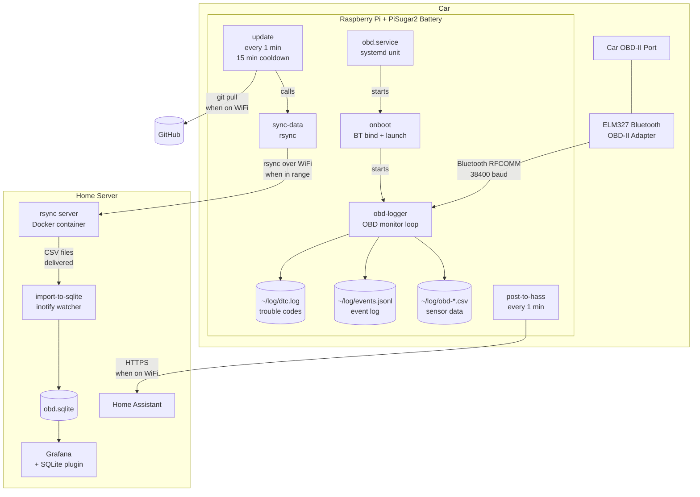

# obd-logger

A Raspberry Pi-based OBD-II data logger that runs in your car. It connects to
an ELM327 Bluetooth adapter, logs sensor data to CSV files, and reports status
to Home Assistant.

## System Architecture

The Pi lives in the car and is **offline during drives**. Data collection and
data processing are fully decoupled:

1. **Driving** — Pi is powered by the car, logs OBD-II sensor data to CSV files
   and operational events to a JSONL event log. No network required.
2. **Car off** — Pi detects the engine shutting down, syncs logs, and schedules
   a shutdown (with a 15-minute grace period in case the car restarts).
3. **Home** — when the car is in WiFi range, cron syncs all logs to a file
   server via rsync. Grafana reads the data from there.

All logs live in `~/log/` and are designed for post-mortem analysis. The event
log (`events.jsonl`) captures every state transition — startup, connection,
car-on, car-off, shutdown scheduled/cancelled, crashes with tracebacks — so
you can reconstruct what happened even in weird sequences like the car turning
off and back on 30 seconds later.

## Known Limitations

- **First ~60 seconds of driving are missed.** The Pi boots from the PiSugar2
  battery when the car powers on, but boot + Bluetooth pairing + OBD
  connection takes about a minute. The car is already moving before the first
  sensor reading is logged.

- **Rsync-based data delivery is old school.** The architecture relies on the
  car being in home WiFi range for sync. There's no real-time streaming, no
  mobile data path, and no retry/queueing beyond cron running every minute.
  A more modern approach would use an MQTT or HTTP push when any network is
  available, but rsync works fine for the "review drives later at home"
  use case.

- **Single car assumption.** The system assumes one Pi, one car, one ELM
  adapter. Drive IDs are derived from CSV filenames with no car identifier.
  The Grafana dashboards have no car selector. Supporting multiple cars would
  require: a car ID in the CSV filenames and SQLite schema, a per-car
  Bluetooth MAC in the `bt-addr` file, and dashboard variables to filter by car.

## What it logs

- **Sensor CSV** (`obd-YYYYMMDD-HHMMSS.csv`) — one file per drive with RPM,
  speed, coolant temp, engine load, throttle, intake temp, MAF, timing advance,
  fuel level, run time, barometric pressure, ELM voltage, PiSugar battery
- **Event log** (`events.jsonl`) — structured operational events for debugging
- **DTC log** (`dtc.log`) — diagnostic trouble codes (check engine light codes)

## Hardware

- Raspberry Pi with Raspberry Pi OS (Trixie)
- PiSugar2 battery module (keeps the Pi alive briefly after the car turns off)
- ELM327 Bluetooth OBD-II adapter

## Setup

See [INSTALL.md](INSTALL.md) for full installation instructions.
